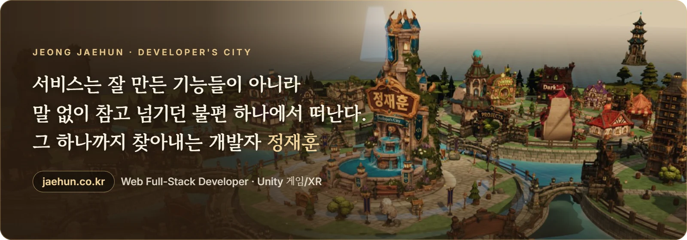
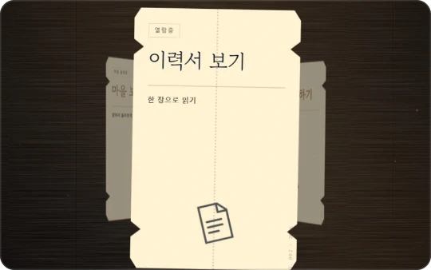
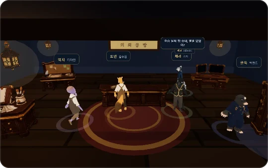
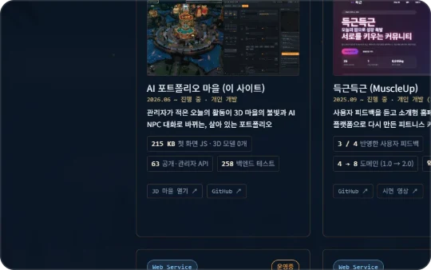
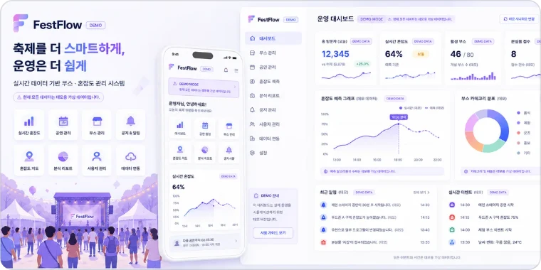
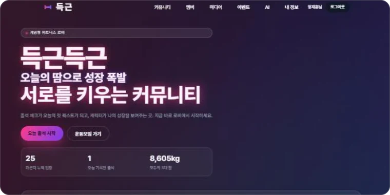
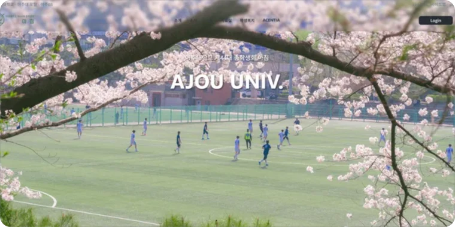
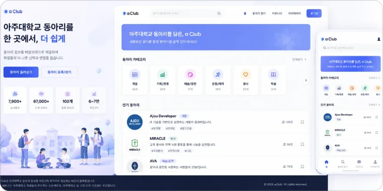
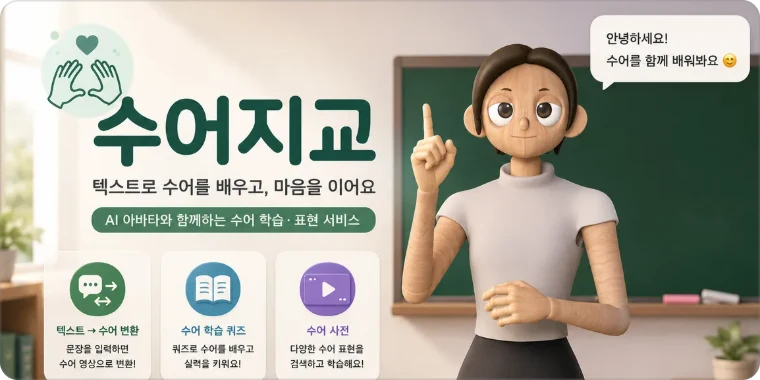
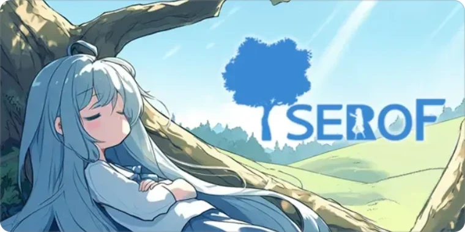

<a href="https://jaehun.co.kr">
  <picture>
    <source media="(prefers-color-scheme: dark)" srcset="assets/banner-dark.webp">
    
  </picture>
</a>

  <a href="https://jaehun.co.kr"><b>포트폴리오 마을</b></a>
  &nbsp;·&nbsp;
  <a href="https://jaehun.co.kr/resume"><b>이력서</b></a>
  &nbsp;·&nbsp;
  <a href="https://jaehun.co.kr/jeong-jaehun-resume.pdf"><b>이력서 PDF</b></a>
  &nbsp;·&nbsp;
  <a href="mailto:toadsam@naver.com"><b>toadsam@naver.com</b></a>

React와 Spring Boot로 서비스를 만들고, 배포한 뒤에 생기는 문제까지 직접 재현해 고치는 신입 개발자입니다. 아주대학교 디지털미디어학과를 2027년 2월에 졸업할 예정이고, 인턴과 정규직 모두 바로 입사할 수 있습니다.

## 지금 만들고 있는 것

### [AI 포트폴리오 마을](https://jaehun.co.kr) &nbsp;2026.06 ~ 진행 중 · 1인 개발

관리자가 적은 오늘의 활동이 3D 마을의 건물 불빛과 AI NPC 대화로 바뀌는 포트폴리오 사이트입니다. 위 배너가 그 마을의 중앙 광장입니다. 채용 담당자가 읽는 이력서 화면과 방문자가 웹사이트 제작을 의뢰하는 공방도 같은 서비스에 있습니다.

<table>
  <tr>
    <td width="33%"></td>
    <td width="33%"></td>
    <td width="33%"></td>
  </tr>
  <tr>
    <td align="center">첫 화면은 표 세 장</td>
    <td align="center">NPC가 릴레이로 묻는 의뢰 공방</td>
    <td align="center">한 장으로 읽는 이력서</td>
  </tr>
</table>

<table>
  <tr>
    <td width="33%" align="center">첫 화면 JS <b>215 KB</b></td>
    <td width="33%" align="center">첫 방문 로딩 <b>20초 → 6초</b></td>
    <td width="33%" align="center">백엔드 <b>API 65개 · 테스트 258개</b></td>
  </tr>
  <tr>
    <td valign="top">첫 화면을 three.js가 없는 별도 라우트로 분리했습니다. 3D 모델은 0개입니다.</td>
    <td valign="top">셰이더 변종을 그리기 전에 한 번에 컴파일합니다. prod 빌드 데스크톱 기준 18~22초에서 6~7초입니다.</td>
    <td valign="top">NPC 관계 결과는 규칙이 정하고 모델은 대사만 씁니다. 그 규칙을 pytest가 잠급니다.</td>
  </tr>
</table>

`Next.js 16` `React 19` `TypeScript` `React Three Fiber` `FastAPI` `SQLAlchemy` `OpenAI API` `Claude Agent SDK`

[사이트](https://jaehun.co.kr) · [저장소](https://github.com/toadsam/myPortfolio/tree/final) · [결정과 실측 기록](https://github.com/toadsam/myPortfolio/blob/final/README.md)

## 프로젝트

<table>
  <tr>
    <td width="50%" valign="top">
      
       
      <b>AjouFesta</b> (구 FestFlow) &nbsp;2026.04 ~ 10 · 개인
       
      아주대 축제에서 두 번 실제 운영한 축제 앱입니다. 5월 대동제에서 AI 소개팅을 하루 돌렸고, 10월 가을축제에서는 주점 QR 주문, 사주 소개팅, 스태프 화면을 이틀 동안 돌렸습니다. 축제 주간 방문자 7,078명, 주점 첫날 주문 142건, 소개팅 가입 322명을 장애 없이 처리했습니다. 가을축제 버전은 Claude Code와 함께 만들었고(커밋 130개 중 129개), 기능과 우선순위는 직접 정하고 AI가 고친 것은 재현 테스트와 두 기기 동시 테스트로 확인했습니다.
        
      <code>React</code> <code>Spring Boot</code> <code>JWT</code> <code>SSE</code> <code>PWA</code> <code>MySQL</code> <code>Claude Code</code>
       
      <a href="https://www.ajoufesta.com">사이트</a> · <a href="mailto:toadsam@naver.com?subject=FestFlow%20%EC%A0%80%EC%9E%A5%EC%86%8C%20%EC%97%B4%EB%9E%8C%20%EC%9A%94%EC%B2%AD">코드는 비공개 · 요청 시 공개</a>
    </td>
    <td width="50%" valign="top">
      
       
      <b>득근득근 MuscleUp</b> &nbsp;2025.09 ~ 2026.06 · 개인
       
      사용자 피드백을 듣고 소개형 홈페이지를 운영형 플랫폼으로 전면 리뉴얼(2026.03)한 피트니스 커뮤니티입니다. 1.0에서 받은 피드백 4건 중 3건을 2.0에 반영했습니다.
        
      <code>React</code> <code>Spring Boot</code> <code>JPA</code> <code>JWT 이중 쿠키</code> <code>AWS</code>
       
      <a href="https://musclehub.co.kr">서비스</a> · <a href="https://github.com/toadsam/Ajou_MuscleUp">저장소</a> · <a href="https://youtu.be/0X-BIADC1eQ">시연 영상</a>
    </td>
  </tr>
  <tr>
    <td width="50%" valign="top">
      
       
      <b>아주대 총학생회 웹</b> &nbsp;2025.03 ~ 진행 중 · 2026년부터 단독
       
      총학생회가 개발자 없이 대여 수량과 링크를 직접 고칠 수 있게 만든 서비스입니다. 검색 노출 12,314회, 클릭 1,694회를 기록했습니다.
        
      <code>React</code> <code>Spring Boot</code> <code>PostgreSQL</code> <code>Docker</code> <code>Nginx</code>
       
      <a href="https://ajouchong.com">사이트</a> · <a href="https://github.com/ajouchong-dev/ajouchong-web/pull/36">프론트 PR</a> · <a href="https://github.com/ajouchong-dev/ajouchong/pull/70">백엔드 PR</a>
    </td>
    <td width="50%" valign="top">
      
       
      <b>aClub</b> &nbsp;2025.01 ~ 2026.03 · 프론트 3인에서 총괄로
       
      프론트 3인 중 한 명으로 시작해 총괄까지 맡은 동아리 운영 서비스입니다. 2026년 1~3월 활성 사용자 3,500명, 조회수 8.8만을 기록했습니다.
        
      <code>React</code> <code>Vite</code> <code>Axios</code> <code>GA4</code>
       
      <a href="https://github.com/aClub2026/FE">저장소</a>
    </td>
  </tr>
  <tr>
    <td width="50%" valign="top">
      
       
      <b>수어지교</b> &nbsp;2026.01 ~ 05 · 4인 팀
       
      수어 동작 영상을 보고 뜻을 익히는 학습 앱입니다. Expo 프론트와 Spring Boot 인증·학습 API를 맡았습니다. 3D 아바타는 팀원이 제작했습니다.
        
      <code>Expo</code> <code>React Native</code> <code>Spring Boot</code> <code>OAuth2</code> <code>Firebase</code>
       
      <a href="https://toadsam.github.io/Sign-Language/home">사이트</a> · <a href="https://github.com/toadsam/Sign-Language">저장소</a>
    </td>
    <td width="50%" valign="top">
      
       
      <b>TSEROF</b> &nbsp;2023.10 ~ 2024.02 · 5인 팀 부팀장
       
      기획부터 Steam 출시까지 4개월에 마친 3D 액션 플랫폼 게임입니다. 스테이지 2와 장애물 기믹, 3×3 패턴 퍼즐을 구현했습니다.
        
      <code>Unity</code> <code>C#</code> <code>Cinemachine</code>
       
      <a href="https://store.steampowered.com/app/2743860/TSEROF/?l=koreana">Steam</a> · <a href="https://www.youtube.com/watch?v=1Lm-lpVsmq8">플레이 영상</a>
    </td>
  </tr>
</table>

만든 도구도 하나 공개해 두었습니다. [codebase-anatomy](https://github.com/toadsam/codebase-anatomy)는 코드베이스를 실제 소스에서 읽어 인터랙티브 HTML 해부도를 만드는 Claude Code 스킬이고, 모든 구조적 주장에 `file:line` 증거를 요구합니다.

## 기술

<table>
  <tr><td><b>Frontend</b></td><td>React · TypeScript · Next.js · Three.js (R3F) · Vite · React Query · Tailwind CSS · Expo</td></tr>
  <tr><td><b>Backend</b></td><td>Spring Boot · Java · JPA · Spring Security · Node.js · Express · FastAPI</td></tr>
  <tr><td><b>Auth</b></td><td>JWT · OAuth2 · Passport · Firebase Auth</td></tr>
  <tr><td><b>Infra / Data</b></td><td>AWS · S3 · CloudFront · MySQL · MongoDB · Firebase</td></tr>
  <tr><td><b>AI / LLM</b></td><td>OpenAI API · Claude Agent SDK · 구조화 출력 · 규칙 기반 폴백</td></tr>
  <tr><td><b>Unity / XR</b></td><td>Unity · C# · AR Foundation · XR Interaction Toolkit · NavMesh</td></tr>
  <tr><td><b>자격</b></td><td>정보처리기사 · SQLD (2026.09 취득)</td></tr>
</table>

  수치의 출처와 측정 조건은 <a href="https://jaehun.co.kr/resume">이력서</a>에 있습니다.

